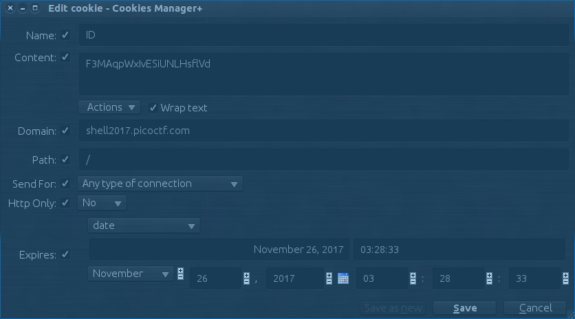
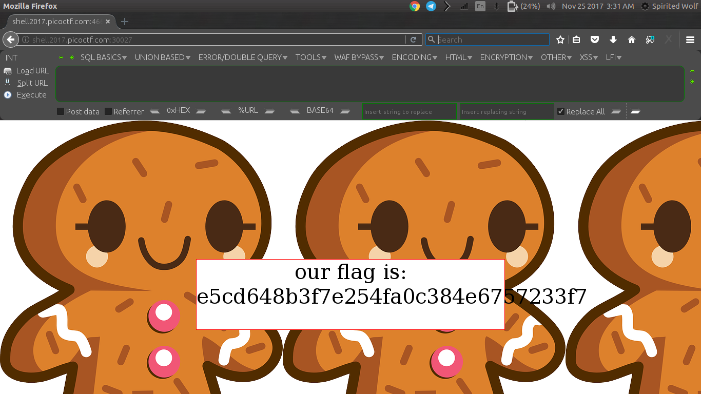

# Biscuit
---
### Question
Your friend has a personal website. Fortunately for you, he is a bit of a noob when it comes to hosting a website. Can you find out what he is hiding? Website.

### HINTS

Viewing the source of the website is usually a good start.

---
# Solution

 I was thinking this challenge will be tuff. But after doing it i came to know it's from one of those easy challenge. Lets dive into the challenge.
 
1. I got a [website](http://shell2017.picoctf.com:30027) link. 
2. Then i start reading the task and the hint which says ```view source code```. So, after checking the source code we see this.
    ```html
    <html>
    <!-- Storing stuff in the same directory as your web server doesn't seem like a good idea -->
    <!-- Thankfully, we use a hidden one that is super PRIVATE, to protect our cookies.sqlite file -->
    <style>
    body{
    	background-image: url("private/image.png");
    }
    </style>
    
    <body >
    <div style='background:white;margin: auto;border: 1px solid red;width: 600px; margin-top: 20%;' >
    <center>
    <form style="font-size: 40px; ">
    Access Denied</form>
    </center>
    </div>
    </body>
    </html>
    ```
4. So we see these text ```to protect our cookies.sqlite file``` and ```background-image: url("private/image.png");```. Lets execute our little brain.sh and  see what will happen if we type : ```/private/cookies.sqlite```. 

5. So now we got one new file name: ```cookies.sqlite``` which is sqlite3 type file. 
   So i quickly opened this file using sqlite3 package.
```bash
$sqlite3 cookies.sqlite 
SQLite version 3.8.2 2013-12-06 14:53:30
Enter ".help" for instructions
Enter SQL statements terminated with a ";"
sqlite> 
```

Now we must know the queries of sqlite. We can use simple [google search for dumping tables in sqlite database](https://stackoverflow.com/questions/82875/how-to-list-the-tables-in-an-sqlite-database-file-that-was-opened-with-attach).

6. Now lets try it out.
    ```SQLITE
    sqlite> select * from sqlite_master where type='table';
    
    table|moz_cookies|moz_cookies|2|CREATE TABLE moz_cookies (id INTEGER PRIMARY KEY, baseDomain TEXT, appId INTEGER DEFAULT 0, inBrowserElement INTEGER DEFAULT 0, name TEXT, value TEXT, host TEXT, path TEXT, expiry INTEGER, lastAccessed INTEGER, creationTime INTEGER, isSecure INTEGER, isHttpOnly INTEGER, CONSTRAINT moz_uniqueid UNIQUE (name, host, path, appId, inBrowserElement))
    
    sqlite> select * from moz_cookies;
    1|localhost|0|0|ID|F3MAqpWxIvESiUNLHsflVd|localhost|/|1489365457|1489279130600290|1489279057101857|0|0
    ```
    
7. Look at ```ID:F3MAqpWxIvESiUNLHsflVd``` it's our cookie. Just use it.

Now change your cookie in your browser for this website. 
   
```Click on Save``` > ```Refresh```
   
 So, i think we got the flag ```e5cd648b3f7e254fa0c384e6757233f7```.
 
 Hope you liked it :)
 
   ~Thanks
   
   [@spiritedwolf](https://github.com/spiritedwolf)

---

